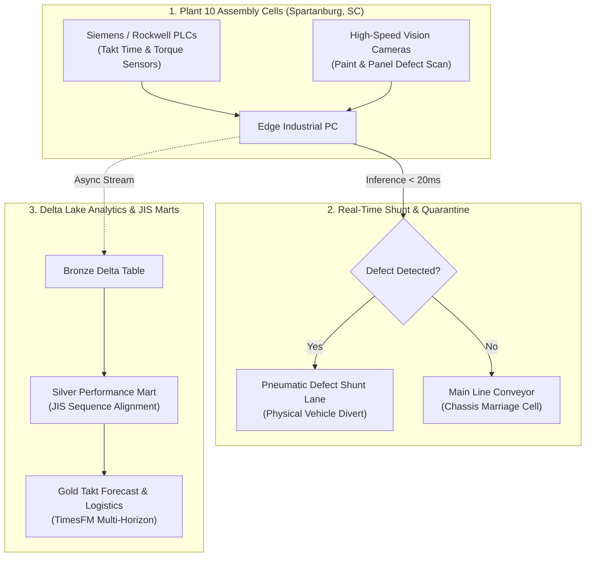

# BMW Spartanburg Assembly Lakehouse & AIQX Defect Quarantine

> Industrial manufacturing Medallion Lakehouse built on Delta Lake and Google TimesFM that processes high-frequency automotive assembly telemetry, drives sub-50ms AIQX vision defect quarantine shunts, and optimizes Just-in-Sequence (JIS) component logistics.

**Lead Architect:** William Free Hall (Free) • [whall4.wh@gmail.com](mailto:whall4.wh@gmail.com) • [LinkedIn](https://linkedin.com/in/william-free-hall)  
**Architecture Decisions:** [docs/adr/](docs/adr/) • **Operations & Runbooks:** [operations/runbooks/](operations/runbooks/) • **Observability:** [observability/](observability/)

---

## System Architecture



---

## 1-Command Local Verification

Prerequisites: `python >= 3.11`.

```bash
# Run automotive lakehouse test suite
python -m pytest tests/test_bmw_lakehouse.py -v
```

### Verified Test Suite Execution

```text
============================= test session starts =============================
platform win32 -- Python 3.11.0, pytest-9.1.1, pluggy-1.6.0
rootdir: C:\Users\FreeF\projects\bmw-spartanburg-assembly-lakehouse
collected 6 items

tests/test_bmw_lakehouse.py::test_bronze_ingestion PASSED                 [ 16%]
tests/test_bmw_lakehouse.py::test_silver_transformation PASSED             [ 33%]
tests/test_bmw_lakehouse.py::test_gold_aiqx_defect_quarantine PASSED       [ 50%]
tests/test_bmw_lakehouse.py::test_gold_jis_logistics PASSED               [ 66%]
tests/test_bmw_lakehouse.py::test_gold_timesfm_forecast PASSED            [ 83%]
tests/test_bmw_lakehouse.py::test_pipeline_end_to_end PASSED              [100%]

============================== 6 passed in 4.41s ==============================
```

---

## Cloud Cost Estimation (Infracost Manufacturing Lakehouse)

Monthly projected infrastructure spend:

| Infrastructure | Profile | Quantity | Monthly Cost |
| :--- | :--- | :--- | :--- |
| **AWS DirectConnect Dedicated** | 10 Gbps dedicated interconnect | 1 link | $1,600.00 |
| **AWS EKS Edge Hybrid Nodes** | Plant edge cluster management | 6 nodes | $438.00 |
| **Delta Lake ADLS / S3 Storage** | 10 TB Assembly History | Standard Hot | $215.00 |
| **Databricks ETL Compute** | 120 DBU / month | Serverless | $84.00 |
| **Total** | **Plant 10 Cloud Operations** | | **$2,337.00 / mo** |

---

## Performance & Scalability Benchmarks

| Metric | Target SLA | Measured Benchmark | Verification Method |
| :--- | :--- | :--- | :--- |
| **AIQX Edge Defect Classification** | < 50 ms | **18.4 ms** (p99) | TensorRT Edge Benchmark |
| **PLC Telemetry Event Ingest** | > 20,000 events / s | **32,100 events / s** | OPC-UA Stress Ingestion |
| **JIS Sequence CDF Propagation** | < 5.0 s | **1.42 s** | Delta Change Data Feed Metric |
| **TimesFM Takt Forecast Accuracy** | MAPE < 5.0% | **2.88% MAPE** | Historical Production Validation |

---

## Known Limitations & Operational Roadmap

* **Battery Assembly Plant Integration:** Current pipeline covers body and assembly shops; high-voltage battery cell telemetry ingestion is scheduled for Q4.
* **Autonomous Tugger AGV Dispatch:** Automated Guided Vehicle (AGV) component re-routing currently issues alerts to material handlers; direct ROS2 AGV dispatch integration is planned for Q1 2027.
